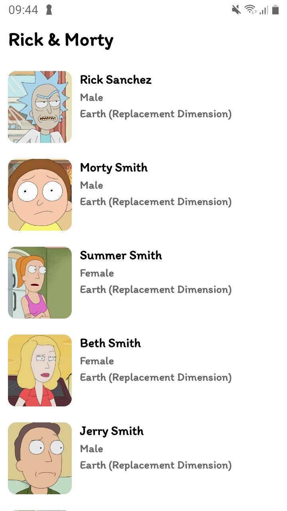
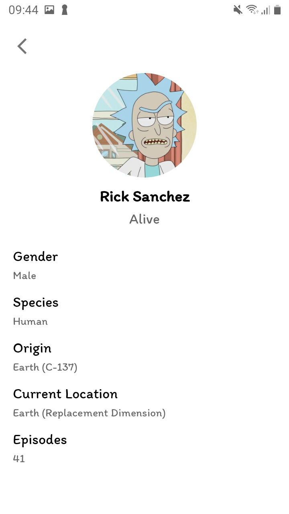

# Rick & Morty 

This app consumes data from the Rick & Morty [API](https://rickandmortyapi.com/). The app is built using Kotlin and encompasses 
the Clean Architecture principle with MVVM approach and Jetpack libraries.

You can download the test apk here - [Rick & Morty](art/rick-and-morty.apk).

Wubalubadubdubbb!! 🤘🏾🤟🏾

## Table of Contents
- [Project Setup](#project-setup)
- [Architecture](#architecture)
- [Libraries](#libraries)
- [Screenshots](#screenshots)
- [Licence](#licence)

## Project Setup 
To setup the project in your machine

- Clone the repo

```console
foo@bar:~$ git clone https://github.com/tirgei/rick-and-morty.git
```

- Set the BASE_URL in the ```local.properties``` file.

You can then import the project to your Android Studio

## Architecture
The app is divided into 3 modules, namely:
- Presentation (app)
- Data
- Domain

This approach is guided by the clean architecture approach which advocates for clear abstraction of the flow 
of data from the business logic to the presentation framework dealing with displaying data to the user. 

#### Presentation
The ```app``` module contains the UI and navigation frameworks and also deals with instantiation of DI
components for the app. [DataBinding](https://developer.android.com/topic/libraries/data-binding) is used to render data to the UI while 
the [ViewModel](https://developer.android.com/topic/libraries/architecture/viewmodel) provides a link to the ```data``` module
via the respective [UseCase](https://proandroiddev.com/why-you-need-use-cases-interactors-142e8a6fe576) s.

#### Data
The ```data``` module deals with loading data from the sample response server. The app is persisted to local cache using [Room](https://developer.android.com/training/data-storage/room).
- ```cache``` package - contains classes dealing with offline persistence
- ```remote``` package - contains classes dealing with fetching data from the API.

#### Domain
The ```domain``` module mainly deals with the model classes which presents the data being used across both the 
```presentation``` module and the ```data``` module.

It defines the UseCase(s) which handle the flow of data from the Repository layer to the ViewModel. It also defines 
the Repository interfaces which the ```data``` module implements to provide data access.

## Libraries
Libraries used in the app include:
- [Jetpack](https://developer.android.com/jetpack) - Jetpack Components
  - [Navigation](https://developer.android.com/guide/navigation)
  - [ViewModel](https://developer.android.com/topic/libraries/architecture/viewmodel)
  - [LiveData](https://developer.android.com/topic/libraries/architecture/livedata)
  - [DataBinding](https://developer.android.com/topic/libraries/data-binding)
  - [Room](https://developer.android.com/training/data-storage/room)
- [Dagger Hilt](https://developer.android.com/training/dependency-injection/hilt-android) - Dependency Injection framework
- [Coroutines](https://developer.android.com/kotlin/coroutines) - Framework for asynchronous processing in Kotlin
- [Retrofit](https://square.github.io/retrofit/) - Types-safe HTTP client for Android
  - [Gson](https://github.com/google/gson)
- [Timber](https://github.com/JakeWharton/timber) - Logging Library
- [Glide](https://github.com/bumptech/glide) - Image loading & caching library
- [Lottie](https://lottiefiles.com/) - Animation library client for Android

For testing, the following libraries are included:
- [JUnit](https://junit.org/junit4/) - Framework to write tests
- [Mockito](https://site.mockito.org/) - Testing mocking framework
- [Truth](https://truth.dev/) - Assertions library by Google
- [Espresso](https://developer.android.com/training/testing/espresso) - Framework to write UI tests

## Screenshots
|**Characters**|**Character Details**|
|--------------|---------------------|
| |  |

## Licence
```
MIT License

Copyright (c) 2021 Vincent Tirgei

Permission is hereby granted, free of charge, to any person obtaining a copy of this software and
associated documentation files (the "Software"), to deal in the Software without restriction, including
without limitation the rights to use, copy, modify, merge, publish, distribute, sublicense, and/or sell
copies of the Software, and to permit persons to whom the Software is furnished to do so, subject to
the following conditions:

The above copyright notice and this permission notice shall be included in all copies or substantial
portions of the Software.

THE SOFTWARE IS PROVIDED "AS IS", WITHOUT WARRANTY OF ANY KIND, EXPRESS OR IMPLIED, INCLUDING BUT NOT
LIMITED TO THE WARRANTIES OF MERCHANTABILITY, FITNESS FOR A PARTICULAR PURPOSE AND NONINFRINGEMENT. IN
NO EVENT SHALL THE AUTHORS OR COPYRIGHT HOLDERS BE LIABLE FOR ANY CLAIM, DAMAGES OR OTHER LIABILITY,
WHETHER IN AN ACTION OF  TORT OR OTHERWISE, ARISING FROM, OUT OF OR IN CONNECTION WITH THE
SOFTWARE OR THE USE OR OTHER DEALINGS IN THE SOFTWARE.
```